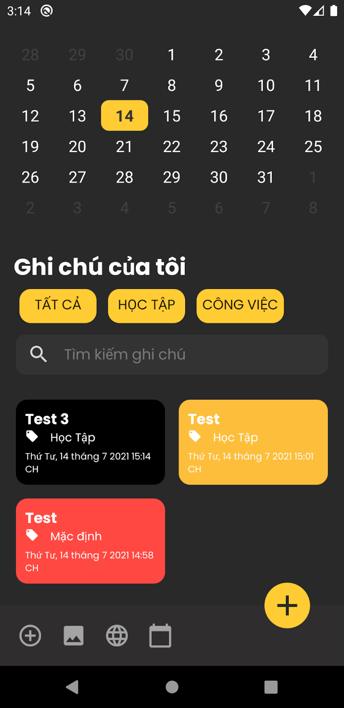

<!-- markdownlint-disable MD033 -->
<!-- markdownlint-disable MD041 -->

  
  <h3><b>Note App</b></h3>
  
Ứng dụng quản lý lịch cá nhân

  
  

## **Mục lục**

- [**Mục lục**](#mục-lục)
- [**Tổng quan**](#tổng-quan)
- [**Các thư viện hỗ trợ**](#các-thư-viện-hỗ-trợ)
- [**Các tính năng**](#các-tính-năng)
- [**Liên hệ**](#liên-hệ)

## **Tổng quan**

Giúp cho người người sử dụng có thể quản lý, lưu trữ và lên lịch trước các công việc cần làm một cách dễ dàng, hiệu quả, không mất nhiều thời gian, từ đó cải thiện hiệu suất công việc.

 

  
  

  <small>Một vài hình ảnh của ứng dụng</small>

 

## **Các thư viện hỗ trợ**

- [**Room**](https://developer.android.com/jetpack/androidx/releases/room): thư viện quản lý CSDL được cải tiến từ SQLite
- [**RecyclerView**](https://developer.android.com/reference/androidx/recyclerview/widget/RecyclerView): một View mới tương tự ListView nhưng cho hiệu suất tốt hơn
- [**Rounded ImageView**](https://github.com/vinc3m1/RoundedImageView): một View giúp bo viền hình ảnh
- [**Lottie Animation**](https://lottiefiles.com/): thư viện đa nền tảng giúp tạo hiệu ứng chuyển động

## **Các tính năng**

- [x] Thêm ghi chú
- [x] Thay đổi thông tin ghi chú
- [x] Xóa ghi chú
- [x] Thêm đường dẫn liên kết vào ghi chú
- [x] Thêm ảnh vào ghi chú
- [x] Lọc ghi chú theo danh mục
- [x] Tìm kiếm các ghi chú theo từ khóa
- [x] Cài đặt giờ hẹn cho ghi chú
- [ ] Lọc ghi chú theo lịch (ngày, giờ,...)
- [ ] Cài đặt các chế độ cho âm báo (lặp lại, chỉ một lần, ...)
- [ ] Tùy chọn nhạc chuông thông báo
- [ ] Lưu trữ ghi chú theo tài khoản cá nhân

## **Liên hệ**

- GitHub [@ZweiWirlbert](https://github.com/ZweiWirlbert)
- GitHub [@nathan22x3](https://github.com/nathan22x3)
- GitHub [@bachletantien](https://github.com/bachletantien)
